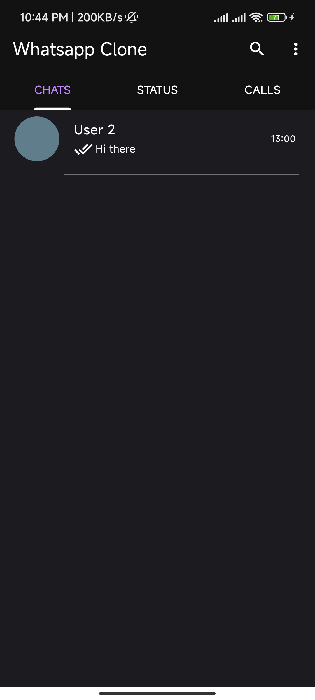
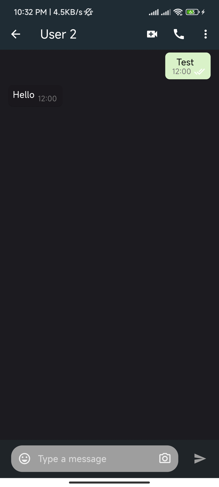
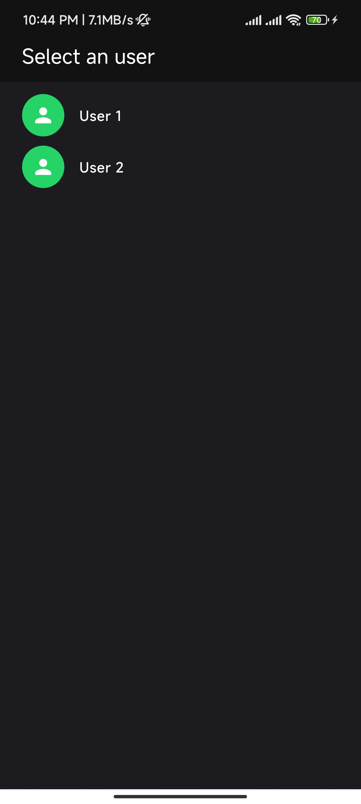

# Flutter WhatsApp Clone

A WhatsApp clone built with Flutter, featuring real-time chat functionality.

## Project Overview

This project is a WhatsApp clone implemented using Flutter. It demonstrates real-time chat functionality using a local server.

## Getting Started

To run this project, follow these steps:

1. Clone the repository:

2. Navigate to the project directory:
   ```
   cd flutter_whatsapp_clone
   ```

3. Install dependencies:
   ```
   flutter pub get
   ```

4. Start the chat server:
   - Navigate to the chat server directory
   - Run the following command:
     ```
     npm run dev
     ```

5. Update the server URL:
   - Open the `utils.dart` file
   - Change the URL to your local IP address
     (You can find your IP address by running `ipconfig` in the terminal)

6. Run the Flutter project:
   - Start two emulators or connect two devices
   - Run the following command for each:
     ```
     flutter run
     ```

7. Using the app:
   - Select User 1 on one device/emulator
   - Select User 2 on the other device/emulator
   - Start chatting in real-time

## Features

- Real-time chat functionality
- Local server implementation
- User selection (User 1 and User 2)

## Note

The real-time chat is currently working on localhost. The project is not hosted on a remote server.

## Resources

For more information on Flutter development:

- [Lab: Write your first Flutter app](https://docs.flutter.dev/get-started/codelab)
- [Cookbook: Useful Flutter samples](https://docs.flutter.dev/cookbook)
- [Online documentation](https://docs.flutter.dev/)

## Screenshots




